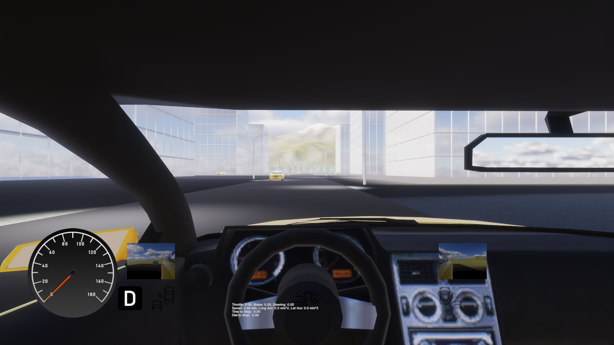
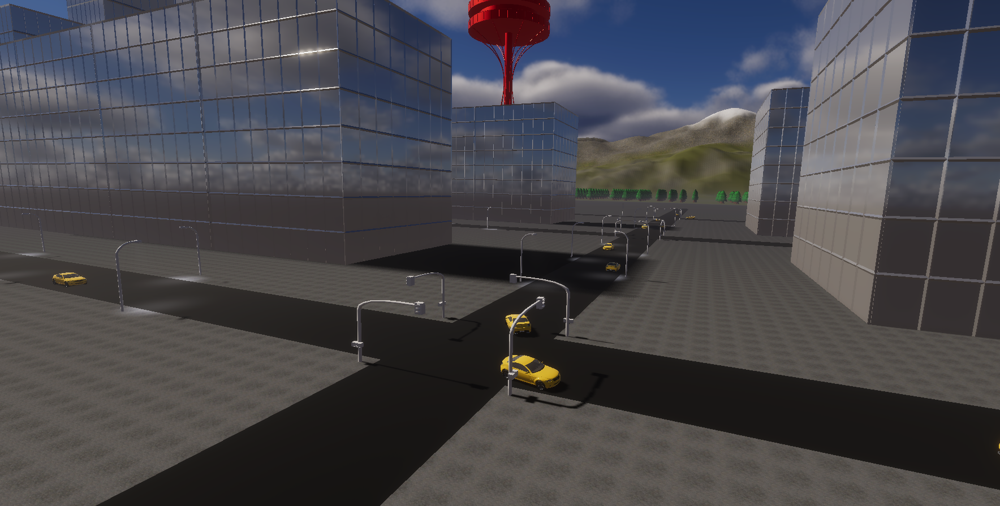
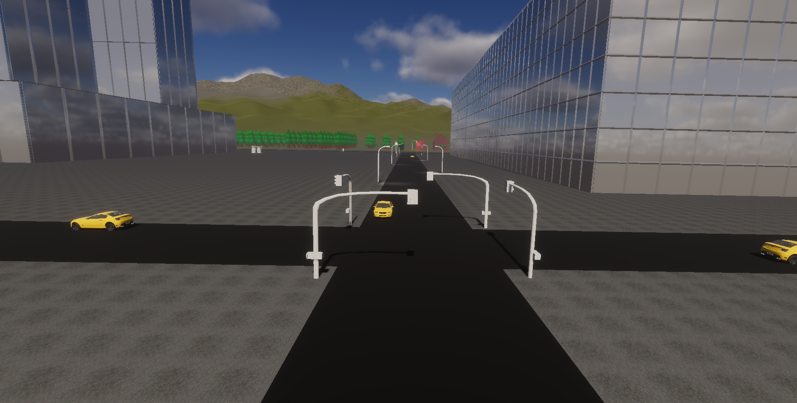

# Unity Vehicle Simulator
### Encroached Cockroach Studio Developers
* Angelo Matteo
* Dennis Wondergem
* Duy Pham
* Jackson Rollins

## What is it?
Unity Vehicle Simulator is a driving simulator that replicates realistic driving manners using Advanced Driver Assistance Systems (ADAS) features. The simulation's ADAS features body collision detection and avoidance that can help improve a player's performance over the course of playing. The player's improvement in the simulation will help their performance in real life.

### What makes our approach different?
Our approach focuses on two main aspects:
1. Realism
    * We're aiming to create a vehicle simulator that's as realistic as we can possible make it, in terms of functionality of the vehicle and traffic/AI. 
2. Original Assets
    * We're also aiming to create as much of the simulator using our own original 3D objects and textures. 
## Controls
Currently our controls consist of the following layout:

| Button/Control  | Action |
| ------------- | ------------- |
| Mouse Movement  | Move Camera  |
| W / Arrow Up  | Accelerator  |
| S / Arrow Down  | Brake  |
| A / Arrow Left  | Steer left  |
| D / Arrow Right  | Steer right  |
| 1  | Select Gear - Drive  |
| 2  | Select Gear - Neutral  |
| 3  | Select Gear - Park |
| 4  | Select Gear - Reverse  |
| F1  | Toggle Camera View  |

## Screenshots

## Binaries/Downloads
Current beta release can be found and downloaded [here.](https://github.com/wondergemd/GameComp/releases/)
Simply extract .zip archive and run the 'Driving Simulator (ECS).exe' file.

## Contact
Please feel free to post in the discusion board [here.](https://github.com/wondergemd/GameComp/discussions)

